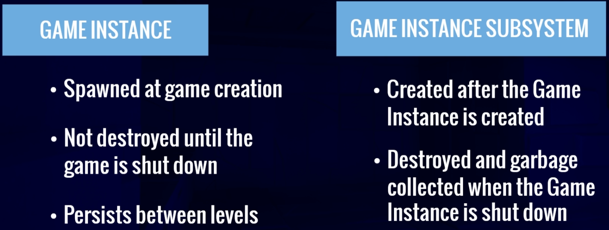

# UE_Multiplayer
- steam online subsystem plugin

## Online SubSystem
- Create online subsystem child
  
	- [MultiplayerSessionsSubsystem.h](./Plugins/MultiplayerSessions/Source/MultiplayerSessions/Public/MultiplayerSessionsSubsystem.h)
	- [MultiplayerSessionsSubsystem.cpp](./Plugins/MultiplayerSessions/Source/MultiplayerSessions/Private/MultiplayerSessionsSubsystem.cpp)
- Accessing the online subsystem
  	```cpp
	public:
		// Pointer to the online session interface
		IOnlineSessionPtr OnlineSessionInterface;
   	```
   
  	```cpp
  	IOnlineSubsystem* OnlineSubsystem = IOnlineSubsystem::Get();
	if (OnlineSubsystem)
	{
		OnlineSessionInterface = OnlineSubsystem->GetSessionInterface();

		/*if (GEngine)
		{
			GEngine->AddOnScreenDebugMessage(INDEX_NONE, 15.0f, FColor::Blue, FString::Printf(TEXT("Found subsystem %s"), *OnlineSubsystem->GetSubsystemName().ToString()));
		}*/
	}
  	```
  
## Join session

## Find sessions

## Create session

## Gamemode
